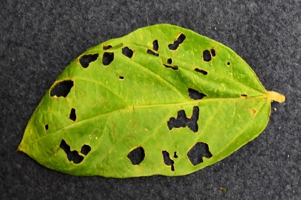
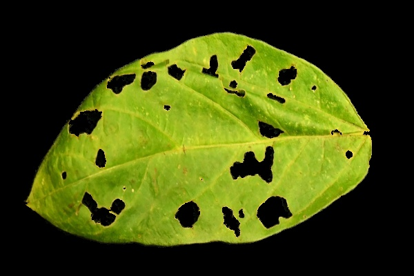
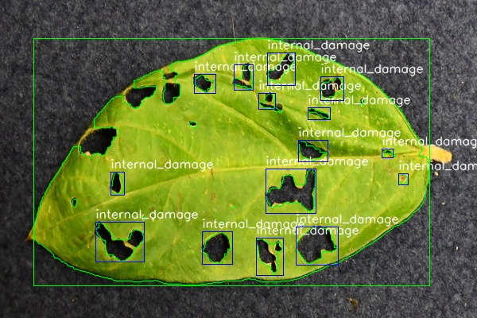

# Leaf Image Segmentation and labeling

### Objective

- Implement a technique that can segment(extract) leaf from an image containing leaf and calculate damage of leaf and finally classify damage of leaf based on damage area

### Resources

- Inspired by the paper: [Automatic Leaf Extraction from Outdoor
Images ](https://arxiv.org/pdf/1709.06437.pdf)

### Usage

- `python3 segment.py`

 __Command structure__
```
usage: segment [-h] [-m MARKER_INTENSITY] [-f {no,flood,threshold,morph}] [-s]
               [-d DESTINATION]
               image_source

positional arguments:
  image_source          A path of image filename or folder containing images

optional arguments:
  -h, --help            show this help message and exit
  -m MARKER_INTENSITY, --marker_intensity MARKER_INTENSITY
                        Output image will be as black background and
                        foreground with integer value specified here
  -f {no,flood,threshold,morph, area}, --fill {no,flood,threshold,morph}
                        Change hole filling technique for holes appearing in
                        segmented output
                        'area is used to create XML data with area of damage of contours'
  -s, --smooth          Output image with smooth edges
  -d DESTINATION, --destination DESTINATION
                        Destination directory for output image. If not
                        specified destination directory will be input image
                        directory
  -c --contours         Destination directory for output contour image.If not
                        specified destination directory will be input image
                        directory
  -g --image_segmentation Destination directory for output image segmentation.If not
                        specified destination directory will be input image
                        directory                      

```

### Examples:

__Command used__: `python -f area -i ./DSC_1030.JPG -d ./destination/ -c ./contours/ -g ./segmented_output/`

__Input Images__
        
 

__Output Images__: `segmented output`






--This program creates XML file with PASCAL VOC format with bounding box co-ordinates and its respective labels Some images need to be edited manually to get better results. Code should be edit as required to get required labels you can verify weather damages are labelled correctly by verifying the contours


